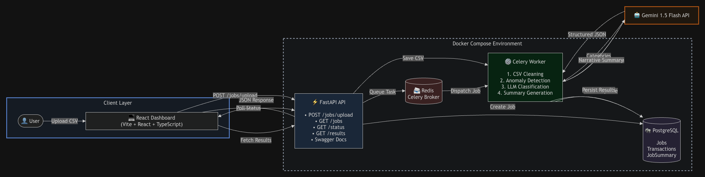
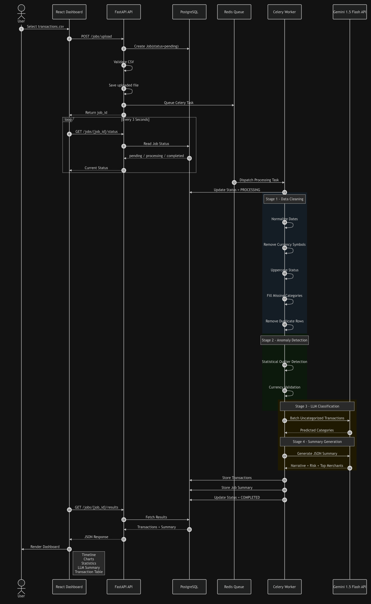
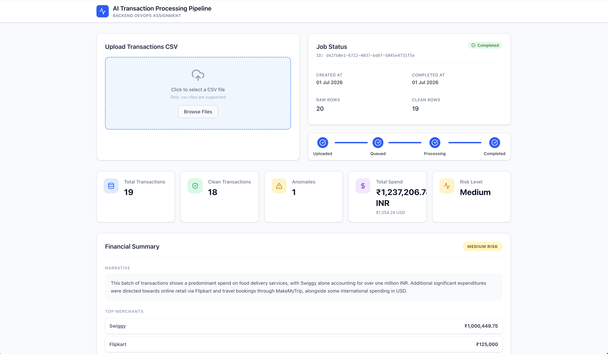
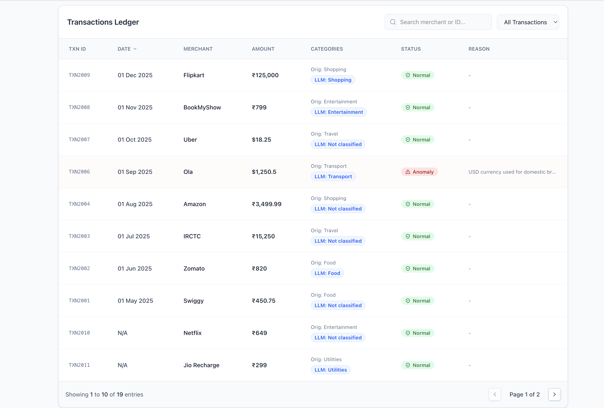
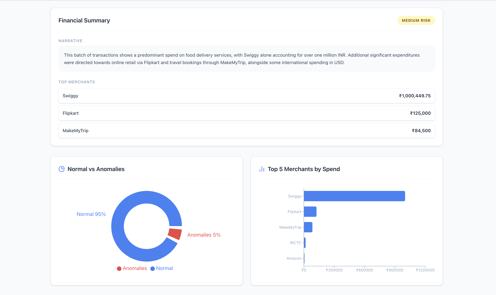

# AI-Powered Transaction Processing Pipeline

An asynchronous backend pipeline that processes financial transaction CSV files, detects anomalies, enriches uncategorized transactions using Gemini 1.5 Flash, and exposes real-time job tracking APIs. The project is fully containerized using Docker Compose and includes a React dashboard for monitoring and visualization.

---

## Features

- Upload transaction CSV files
- Asynchronous processing using Celery + Redis
- Data cleaning and normalization
- Duplicate removal
- Statistical anomaly detection
- Batch LLM transaction categorization
- AI-generated financial summary
- Job status polling
- Interactive analytics dashboard
- Dockerized deployment

---

# Architecture



---

# Request Lifecycle



---

# Tech Stack

| Component | Technology |
|-----------|------------|
| Frontend | React, TypeScript, Vite, Tailwind CSS |
| Backend | FastAPI |
| Database | PostgreSQL |
| Queue | Celery |
| Message Broker | Redis |
| ORM | SQLAlchemy |
| Database Migration | Alembic |
| LLM | Google Gemini 1.5 Flash |
| Charts | Recharts |
| Containerization | Docker & Docker Compose |

---

# Project Structure

```
txn-pipeline
│
├── app
│   ├── api
│   ├── core
│   ├── database
│   ├── models
│   ├── prompts
│   ├── schemas
│   ├── services
│   ├── tasks
│   ├── utils
│   └── workers
│
├── frontend
│
├── migrations
│
├── docs
│   ├── architecture.png
│   ├── sequence-diagram.png
│   ├── dashboard.png
│   ├── job-status.png
│   └── analytics.png
│
├── tests
│
├── Dockerfile
├── docker-compose.yml
├── requirements.txt
└── README.md
```

---

# Processing Pipeline

Once a CSV file is uploaded, the following workflow is executed asynchronously.

```
Upload CSV
      │
      ▼
Create Job
      │
      ▼
Queue Celery Task
      │
      ▼
CSV Cleaning
      │
      ▼
Anomaly Detection
      │
      ▼
Gemini Batch Classification
      │
      ▼
Gemini Financial Summary
      │
      ▼
Persist Results
      │
      ▼
Update Job Status
      │
      ▼
Dashboard Polls Results
```

---

# Data Cleaning

The pipeline performs the following preprocessing steps:

- Normalize mixed date formats
- Remove currency symbols
- Normalize status values
- Fill missing categories
- Remove duplicate transactions
- Handle missing transaction IDs where possible

---

# Anomaly Detection

The worker identifies anomalies using:

- Statistical outlier detection (greater than 3× account median)
- Currency inconsistency checks
- Suspicious transaction notes

---

# LLM Integration

Gemini 1.5 Flash is used for two independent tasks.

### Transaction Classification

Uncategorized transactions are sent in batches to Gemini to classify them into one of:

- Food
- Shopping
- Travel
- Transport
- Utilities
- Entertainment
- Cash Withdrawal
- Other

### Financial Summary

A single LLM request generates:

- Total spend by currency
- Top merchants
- Spending narrative
- Risk level
- Overall summary

Retry logic with exponential backoff is implemented for failed requests.

---

# API Endpoints

## Upload CSV

```
POST /api/v1/jobs/upload
```

Uploads a CSV and queues a background processing job.

---

## Get Job Status

```
GET /api/v1/jobs/{job_id}/status
```

Returns

- Pending
- Processing
- Completed
- Failed

---

## Get Results

```
GET /api/v1/jobs/{job_id}/results
```

Returns

- Cleaned transactions
- Detected anomalies
- AI summary
- Merchant statistics

---

## List Jobs

```
GET /api/v1/jobs
```

Supports filtering by status.

---

# Running Locally

## Clone Repository

```bash
git clone https://github.com/RajAditya7777/txn-pipeline.git

cd txn-pipeline
```

---

## Configure Environment

Create a `.env` file.

Example:

```env
DATABASE_URL=postgresql://postgres:postgres@db:5432/transactions

REDIS_URL=redis://redis:6379/0

GEMINI_API_KEY=YOUR_GEMINI_API_KEY
```

---

## Start the Application

```bash
docker compose up --build
```

This starts:

- FastAPI
- PostgreSQL
- Redis
- Celery Worker

---

## Frontend

```bash
cd frontend

npm install

npm run dev
```

Frontend:

```
http://localhost:5173
```

Backend:

```
http://localhost:8000
```

Swagger UI:

```
http://localhost:8000/docs
```

---

# Screenshots

### Dashboard



### Job Status



### Analytics



---

# Example Workflow

1. Upload a CSV
2. Receive Job ID
3. Dashboard begins polling
4. Worker processes transactions
5. Gemini enriches the data
6. Results are persisted
7. Dashboard automatically updates

---

# Future Improvements

- JWT Authentication
- Role-based access
- Amazon S3 for file storage
- Kubernetes deployment
- Horizontal worker scaling
- Redis Cluster
- Prometheus & Grafana monitoring
- WebSocket updates instead of polling

---

# Design Decisions

- Celery was chosen to decouple heavy processing from the API.
- Redis serves as the message broker for asynchronous execution.
- Batch LLM requests reduce API calls and improve throughput.
- PostgreSQL stores normalized transactional data and job metadata.
- Docker Compose provides a reproducible development environment.
- Polling was selected over WebSockets to keep the implementation simple while satisfying the assignment requirements.

---

# Author

**Aditya Raj**

Backend & Full Stack Developer

GitHub: [RajAditya7777](https://github.com/RajAditya7777)

LinkedIn: [Aditya Raj](https://www.linkedin.com/in/aditya-raj-2630b6323/)
