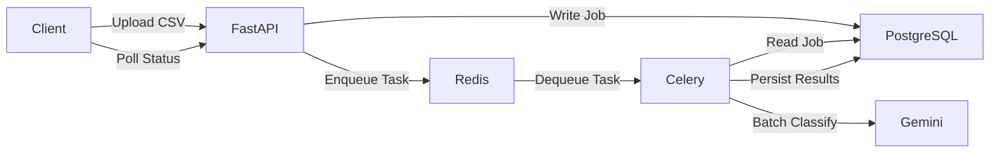

# Transaction Processing Pipeline

An AI-powered asynchronous transaction processing pipeline built using FastAPI, PostgreSQL, Redis, Celery, Docker, and the Gemini 1.5 Flash API. This system accepts raw, dirty transaction data via CSV uploads, securely pipelines it through an asynchronous task queue, rigorously cleans and normalizes the data, detects statistical anomalies, and leverages LLMs for intelligent categorization and narrative summarization.

## Features

- **CSV Upload**: Secure asynchronous file ingestion.
- **Background Job Queue**: Non-blocking Celery workers for heavy data processing.
- **Data Cleaning**: Strips currency symbols, handles missing values, and normalizes dates to strict ISO 8601.
- **Anomaly Detection**: Flags transactions exceeding statistical thresholds or violating geographic constraints.
- **Batch LLM Categorization**: Dynamically predicts transaction categories without overwhelming external APIs.
- **AI-Generated Spending Summary**: Synthesizes a comprehensive financial narrative.
- **Job Status Polling**: Real-time insights into processing states.
- **Dockerized Deployment**: Zero-setup orchestration with Docker Compose.

## Architecture



## Tech Stack

- **API Framework**: FastAPI
- **Database**: PostgreSQL with SQLAlchemy 2.0 and Alembic
- **Task Queue**: Celery
- **Message Broker & Result Backend**: Redis
- **Data Processing**: Pandas
- **AI Integration**: Google Gemini 1.5 Flash API
- **Containerization**: Docker and Docker Compose

## Project Structure

- `app/api/`: FastAPI route controllers (endpoints only).
- `app/core/`: Centralized configuration (Pydantic Settings) and logging.
- `app/database/`: SQLAlchemy engine initialization and session management.
- `app/models/`: SQLAlchemy ORM entity definitions.
- `app/schemas/`: Pydantic models for API request/response validation.
- `app/services/`: Isolated business logic (CSV cleaning, anomaly detection, LLM operations).
- `app/tasks/`: Celery background job definitions.
- `app/workers/`: Celery application initialization.
- `migrations/`: Alembic database migration scripts.

## Prerequisites

- **Docker**
- **Docker Compose**
- **Gemini API Key**

## Environment Variables

| Variable | Description | Default / Example |
|---|---|---|
| `PROJECT_NAME` | Name of the application | AI Transaction Processing Pipeline |
| `ENVIRONMENT` | Deployment environment | development |
| `DEBUG` | Toggle debug mode | True |
| `LOG_LEVEL` | Application logging level | INFO |
| `SECRET_KEY` | Cryptographic secret key | your-super-secret-key-change-in-production |
| `POSTGRES_USER` | PostgreSQL user | postgres |
| `POSTGRES_PASSWORD` | PostgreSQL password | postgres_password |
| `POSTGRES_SERVER` | PostgreSQL host | db |
| `POSTGRES_PORT` | PostgreSQL port | 5432 |
| `POSTGRES_DB` | PostgreSQL database name | txn_pipeline |
| `REDIS_URL` | Redis connection string | redis://redis:6379/0 |
| `GEMINI_API_KEY` | Key for Google's Gemini API | *required* |

## Setup

1. Copy `.env.example` to `.env`:
```bash
cp .env.example .env
```

2. Add your Gemini API key inside the `.env` file:
```env
GEMINI_API_KEY=YOUR_GEMINI_API_KEY
```

3. Run:
```bash
docker compose up --build
```

*Note: Alembic database migrations execute automatically within the API container right before the application starts, requiring zero manual database configuration.*

## API Endpoints

### POST `/api/v1/jobs/upload`
**Purpose**: Upload a CSV file, create a background processing job, and enqueue the task.
- **Request**: `multipart/form-data` containing a `file` field with the CSV.
- **Response**: Returns a `202 Accepted` with the generated `job_id` and a success message.

### GET `/api/v1/jobs`
**Purpose**: List all background processing jobs.
- **Request**: Optional query parameter `?status=` (e.g., pending, processing, completed, failed).
- **Response**: Array of job objects including their ID, filename, status, row counts, and creation timestamps.

### GET `/api/v1/jobs/{job_id}/status`
**Purpose**: Poll the current state of a specific processing job.
- **Request**: Path parameter `job_id` (UUID).
- **Response**: The current status, potential error messages, and operational row counts.

### GET `/api/v1/jobs/{job_id}/results`
**Purpose**: Retrieve the final structured output of a completed pipeline run.
- **Request**: Path parameter `job_id` (UUID).
- **Response**: Aggregated JSON containing `summary`, `cleaned_transactions`, and `anomalies`.

## Example cURL Commands

**Upload a CSV File**
```bash
curl -X POST "http://localhost:8000/api/v1/jobs/upload" \
  -H "accept: application/json" \
  -H "Content-Type: multipart/form-data" \
  -F "file=@assignment/transactions.csv"
```

**List All Jobs**
```bash
curl -X GET "http://localhost:8000/api/v1/jobs" -H "accept: application/json"
```

**Filter Jobs by Status**
```bash
curl -X GET "http://localhost:8000/api/v1/jobs?status=completed" -H "accept: application/json"
```

**Check Job Status**
```bash
curl -X GET "http://localhost:8000/api/v1/jobs/YOUR_JOB_ID_HERE/status" -H "accept: application/json"
```

**Get Final Results**
```bash
curl -X GET "http://localhost:8000/api/v1/jobs/YOUR_JOB_ID_HERE/results" -H "accept: application/json"
```

## Processing Pipeline

The pipeline is strictly isolated into discrete, modular phases:

1. **CSV Upload**: Client securely uploads the raw transaction payload.
2. **Job Creation**: API registers a tracking UUID in PostgreSQL.
3. **Redis Queue**: The task is pushed to the Redis message broker, instantly unblocking the API.
4. **Celery Worker**: A background worker claims the task.
5. **Cleaning**: The `CSVCleaner` service normalizes dates to ISO 8601, drops exact duplicates, strictly uppercase normalizes categorical strings, and scrubs currency symbols via Pandas.
6. **Anomaly Detection**: The `AnomalyDetector` engine applies rule-based heuristics (e.g., amount > 3x median, USD domestic mismatches) to isolate suspicious transactions.
7. **Gemini Classification**: Uncategorized transactions are bundled by `LLMClassifier` and sent in a single batch query to Gemini, enforcing a structured JSON response schema to predict categories dynamically.
8. **Summary Generation**: The `SummaryGenerator` aggregates total operational spending statistics and queries Gemini to draft a human-readable spending narrative.
9. **Database**: Both clean records and anomalous outliers are securely persisted via SQLAlchemy block commits.
10. **Results API**: Client queries the results endpoint for the finalized structured report.

## Design Decisions

- **FastAPI**: Chosen for its high performance, native async capabilities, and out-of-the-box Pydantic validation and OpenAPI generation.
- **Celery & Redis**: An industry-standard, production-proven architecture for offloading blocking I/O (like heavy CSV parsing and external LLM API calls).
- **SQLAlchemy 2.0**: Ensures robust, strictly typed database interactions, mitigating SQL injection risks and keeping the object layer deeply decoupled.
- **Docker**: Eradicates "it works on my machine" syndrome. One command bootstraps the entire infrastructure.
- **Google Gemini 1.5 Flash**: Delivers rapid, cost-effective inference while inherently supporting strict JSON formatting to guarantee programmatic predictability.

## Error Handling

- **Graceful LLM Degradation**: If the Gemini API experiences total failure, the Celery pipeline catches the exception, permanently marks the affected rows with `llm_failed=True`, logs the exact stack trace, and proceeds with the job. It does **not** fail the entire pipeline run.
- **Exponential Backoff**: Transient network faults hitting the Gemini API trigger automatic retries utilizing exponential backoff timers, securing the pipeline against arbitrary timeouts.

## Future Improvements

- **JWT Authentication**: Protect the API endpoints natively via OAuth2.
- **S3 Storage**: Migrate the temporary local volume upload strategy directly to Amazon S3 for unbounded horizontal scaling.
- **Horizontal Worker Scaling**: Provision independent Celery queues (e.g., standard vs. high-priority jobs) running across parallelized ECS clusters.
- **Prometheus + Grafana**: Expose native metrics endpoints to visualize queue depths and pipeline bottlenecks.
- **Kubernetes Deployment**: Fully orchestrate the application using Helm charts.
- **WebSocket Notifications**: Push job status updates directly to clients rather than requiring polling.

## License

MIT
